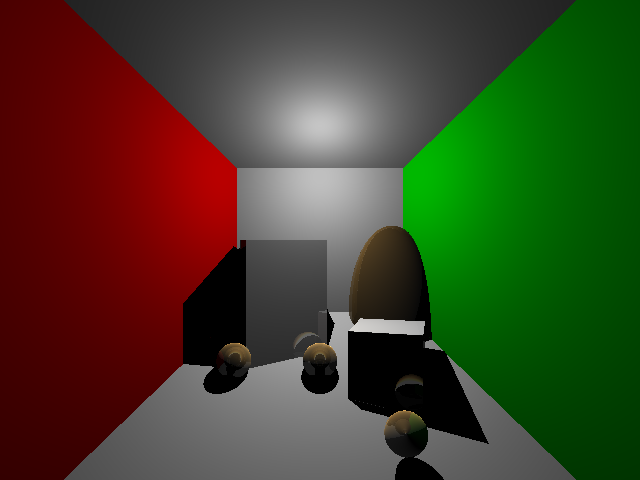
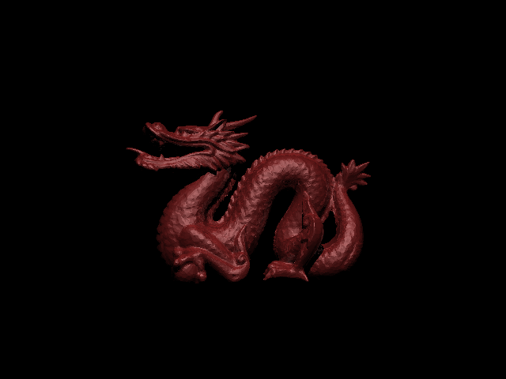

# Ray Tracer Project

## Sample Images

*Modified Cornell Box*

*Stanford Dragon*

## Introduction
Welcome to my Ray Tracer project! This project is a C++ implementation of a ray tracer, a rendering technique for generating an image by tracing the path of rays through a 3D scene. The ray tracer simulates the physics of light to create realistic images with shadows, reflections, and more.

## Features
### Camera Model
The camera model is encapsulated in the Scene class, which contains parameters like eyePosition, lookAt, up, fovy, and fovx. These parameters define the camera's position, orientation, and field of view. The Scene class also calculates the corner points of the virtual screen (topLeft, topRight, bottomLeft, bottomRight) based on these parameters.

### Scene Description
The Scene class also contains a list of objects (std::vector<std::shared_ptr<Shape>> objects) and lights (std::vector<std::shared_ptr<Light>> lights) in the scene. It provides methods for adding objects and lights to the scene and for creating rays based on sample points.

### Ray-Sphere and Ray-Triangle Intersections
The Sphere and Triangle classes inherit from the Shape class and implement their own intersect methods to check for intersections with rays. The Sphere class uses the quadratic formula to solve for the intersection points, while the Triangle class first checks if the ray intersects the plane of the triangle, then checks if the intersection point is inside the triangle using barycentric coordinates.

### Lighting and Shadows Model
The RayTracer class handles the lighting and shadow calculations. The model can handle both point lights and directional lights. It uses Phong shading to calculate the diffuse and specular components. Shadows are determined by casting shadow rays towards each light source and checking for intersections with other objects.


*The lighting model is not currently fully functional. Although the images generated are in general of a good quality, there are occasional slight hiccups which I'm working on.*

### Recursive Ray-Tracing
The RayTracer class also implements recursive ray tracing for reflections. The findColor method is recursively called for reflection rays up to a maximum recursion depth (maxRecursionDepth), which can be set in the Scene class.

### Optimization
The main optimization technique implemented was the parallelization of the ray tracing process using multi-threading to take advantage of multi-core processors. This provided a ~6x speedup on my 6-core processor. The number of threads can be manually set in the RayTracer class.

### How to Build and Run
To build the project, navigate to the project directory and run:

```
make
```
make

To run the ray tracer, execute:
```
./raytracer <scene_file>
```
where <scene_file> is the path to the scene file, specified according to the format found [here](https://inst.eecs.berkeley.edu/~cs294-13/fa09/assignments/raytrace.pdf) (property of Ravi Ramamoorthi, UC Berkeley).
*I'm not affiliated with UC Berkeley or Ravi Ramamoorthi, I just used their scene file format for this project.*

#### Future Work
- Implement more shapes like cylinders, cones, planes, tetrahedrons, etc.
- Add support for textured materials.
- Implement more advanced lighting features like soft shadows, glossy reflections, interreflections (color bleeding) using radiosity methods, and complex illumination effects (natural/area lights)
- Optimize using acceleration structures: bounding volume hierarchies (BVH), kd-trees, octrees, grids, etc.
- Anti-aliasing (multiple rays per pixel)
